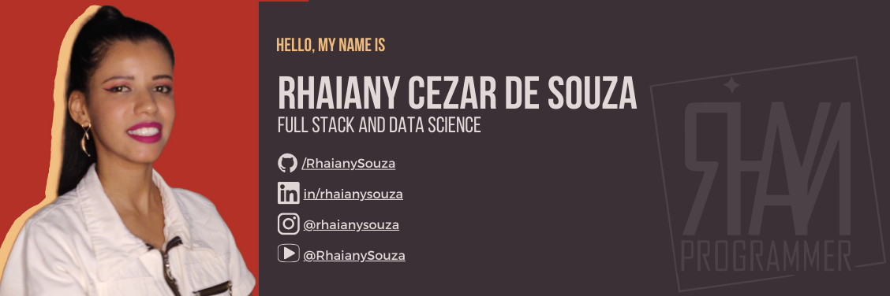

<!--
**RhaianySouza/RhaianySouza** is a ✨ _special_ ✨ repository because its `README.md` (this file) appears on your GitHub profile.

Here are some ideas to get you started:

-->

  

<table>
  <tr>
    <td>

Sou uma profissional apaixonada por Tecnologia da Informação, com formação sólida na área e um mindset voltado para aprendizado e crescimento contínuos. Tenho conhecimentos em programação, análise de sistemas e gestão de projetos, adquiridos ao longo da minha formação acadêmica e experiência prática. Atualmente, estou cursando <b>Sistemas de Informação na UniFOA</b> e realizando <b>estágio na CSN, onde atuo com SAP FI, CO e FM</b>, aplicando e aprimorando minhas habilidades no ambiente corporativo.

Além disso, faço parte do <b>projeto da UFF/CNPq SGIMP (Processo nº 405482/2022-1)</b>, que visa a automatização da gestão de inventário de materiais perigosos em embarcações mercantes, plataformas offshore e navios abandonados destinados ao descomissionamento, desmonte e reciclagem.

Estou sempre em busca de desafios que me permitam crescer profissionalmente, contribuindo de forma eficaz para os projetos em que estou envolvida. Minha dedicação, pensamento analítico e vontade de enfrentar novos desafios fazem de mim uma profissional comprometida com a evolução no dinâmico mundo da tecnologia.

    </td>
    <td>

I am a professional passionate about Information Technology, with solid training in the field and a mindset focused on continuous learning and growth. I have knowledge in programming, systems analysis, and project management, acquired throughout my academic journey and practical experience. Currently, I am pursuing a Bachelor's degree in <b>Information Systems at UniFOA</b> and interning at <b>CSN, where I work with SAP FI, CO, and FM</b>, applying and improving my skills in a corporate environment.

 Additionally, I am part of the <b>UFF/CNPq SGIMP project (Process No. 405482/2022-1)</b>, which aims to automate the inventory management of hazardous materials on merchant ships, offshore platforms, and abandoned vessels intended for decommissioning, dismantling, and recycling.

I am always looking for challenges that allow me to grow professionally, effectively contributing to the projects I am involved in. My dedication, analytical thinking, and willingness to tackle new challenges make me a committed professional in the dynamic world of technology.

    </td>
  </tr>
  <tr>
    <td>
<h3>Sobre mim</h3>

🔭 Atualmente trabalhando no estágio na CSN, com SAP FI, CO e FM, e no projeto SGIMP.

🌱 ERP & Business Processes: SAP FI (Financial Accounting), CO (Controlling), FM (Funds Management).

🌱 Data Science & Automation: Automação de processos e gestão de inventário inteligente (Projeto SGIMP).

🌱 Aprimorando minhas habilidades em Java, PHP e C#.

📫 Como me encontrar: <a href="https://www.linkedin.com/in/rhaianysouza">LinkedIn</a>

🌎 Sou de Volta Redonda, RJ - Brasil

    </td>
    <td>
<h3>About me</h3>

🔭 Currently working on my internship at CSN, focusing on SAP FI, CO, and FM, and the SGIMP project.

🌱 ERP & Business Processes: SAP FI (Financial Accounting), CO (Controlling), FM (Funds Management).

🌱 Data Science & Automation: Process automation and smart inventory management (SGIMP Project).

🌱 I’m currently improving my skills in Java, PHP and C#.

📫 How to reach me: <a href="https://www.linkedin.com/in/rhaianysouza">LinkedIn</a>

🌎 I'm from Volta Redonda, RJ - Brasil

    </td>
  </tr>
</table>

<h3>Connect with me:</h3>

<h3>Languages & Tools:</h3>

  <a href="https://github.com/RhaianySouza">
    <!--img width="300px" src="https://github-readme-stats.vercel.app/api?username=RhaianySouza&show_icons=true&theme=moltack&include_all_commits=False&count_private=true"/-->
    
    <!--img height="300px" src="https://github-readme-stats.vercel.app/api/top-langs/?username=RhaianySouza&langs_count=16&theme=moltack"/-->
    
    
  </a>

 
<h3>Projetos em C</h3>

<h3>Projetos em HTML, CSS e Javascript</h3>

<h3>Projetos em Java</h3>

<h3>Projetos em Python</h3>

 

